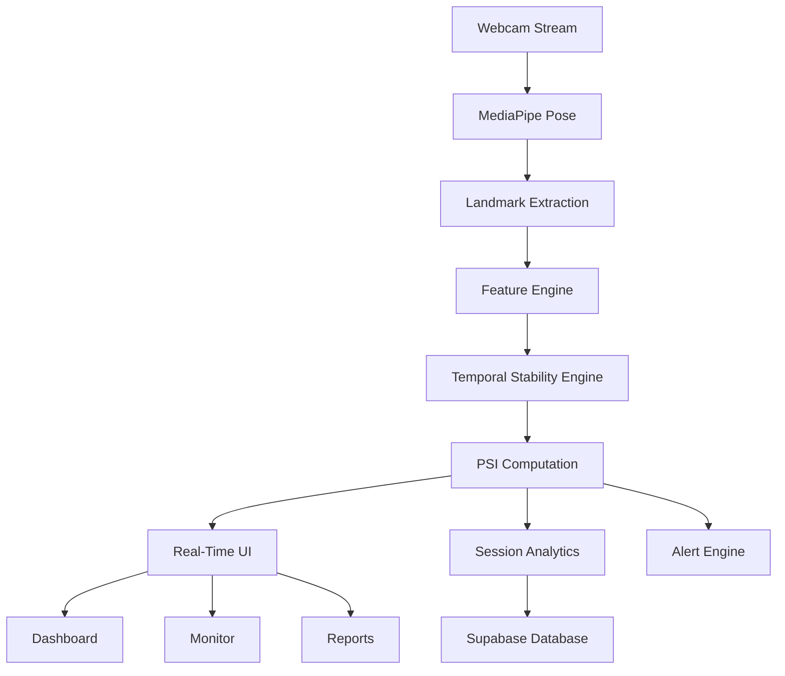

<div align="center">


# Posture+

**Real-Time AI Posture Monitoring — No Wearables Required**

[](https://github.com/DarkBytezz/PosturePlus/stargazers)
[](https://github.com/DarkBytezz/PosturePlus/forks)
[](https://github.com/DarkBytezz/PosturePlus/issues)
[](LICENSE)


🌐 **[posture-plus.vercel.app](https://posture-plus.vercel.app)**

</div>

---

Posture+ is a real-time posture monitoring system that runs entirely in your browser using your webcam. It detects posture instability through **temporal analysis** — identifying sustained slouch patterns rather than momentary dips.

No wearables. No sensors. No recordings. Just your laptop camera and five seconds to calibrate.

---

## Why Posture+

Most posture tools work like this:

```python
if shoulder_angle > threshold:
    alert()
```

This misses the point. A single bad frame doesn't mean bad posture. Posture+ instead evaluates **how posture behaves over time**, detecting:

- Sustained forward head posture
- Lateral head tilt
- Shoulder imbalance
- Posture fatigue during long sessions

Alerts only fire when instability is genuinely sustained — not on random dips.

---

## Research Context

Posture+ is built on a research framework developed for real-time posture stability analysis. The work has been **accepted for presentation at IEEE CSPA 2026**, modeling posture as a temporal stability signal rather than a geometric threshold.

The mathematical formulation behind the scoring system is intentionally not disclosed in this repository.

---

## Core Concept — PSI

The system scores posture using a composite metric called the **Posture Stability Index (PSI)**.

PSI evaluates:

- Posture quality (deviation from baseline)
- Temporal stability (variance over time)
- Degradation patterns (worsening drift)
- Recovery behavior (time to recover from red zones)
- Fatigue signals (session-level decline)

Instead of binary good/bad alerts, PSI provides a **continuous 0–100 stability score** throughout a session.

---

## System Architecture



All processing runs **locally in the browser**. No video is uploaded anywhere.

---

## Features

| Feature | Description |
|---|---|
| Real-Time Monitoring | Tracks upper body landmarks every frame via MediaPipe Pose |
| Temporal Analysis | Evaluates posture across time windows, not single frames |
| PSI Score | Continuous 0–100 stability score with live chart |
| Smart Alerts | Configurable delay, repeat interval, sound, and browser notifications |
| Adaptive Recalibration | Baseline drifts only during verified stable posture — slouch can't become the new normal |
| Session Analytics | PSI timeline, zone exposure, fatigue detection, stability degradation index |
| Privacy First | No video stored or uploaded — only posture metrics |
| Guest Mode | No account needed — session vanishes on reload |

---

## Tech Stack

**Frontend** — React 19, Vite, TypeScript, Tailwind CSS

**Computer Vision** — MediaPipe Pose (runs in-browser via WASM)

**Backend** — Supabase, PostgreSQL, Row Level Security

**Infrastructure** — Vercel, Turborepo, pnpm workspaces

---

## Database Schema

| Table | Purpose |
|---|---|
| `users` | Profile and auth metadata |
| `sessions` | Per-session analytics (PSI, duration, zone distribution, fatigue) |
| `posture_samples` | Raw posture samples captured during sessions |
| `daily_summaries` | Aggregated daily statistics for the dashboard chart |

---

## Running Locally

```bash
# Clone
git clone https://github.com/DarkBytezz/PosturePlus.git
cd PosturePlus

# Install
pnpm install

# Start
pnpm dev
```

Open `http://localhost:5173` and allow camera access when prompted.

**Environment variables** — create `.env` in `apps/web/`:

```
VITE_SUPABASE_URL=your_supabase_url
VITE_SUPABASE_ANON_KEY=your_supabase_key
```

---

## Calibration

1. Sit upright and face the screen directly
2. Click **Calibrate** in the Monitor tab
3. Hold your posture for ~5 seconds

This establishes your personal baseline. The system adapts to your natural seated position, not a generic template.

---

## Current Limitations

- Works best with laptop webcams and seated desk posture
- User should be centered and reasonably well-lit in frame
- Mobile layout is currently limited

---

## Roadmap

- [ ] Mobile layout optimization
- [ ] Session drill-down into raw samples
- [ ] CSV export for research use
- [ ] Long-term trend analysis
- [ ] Posture coaching mode

---

## Author

**Manan Verma**
B.E. Computer Science (AI & ML), Chandigarh University

[GitHub](https://github.com/DarkBytezz)

---

## License

MIT — see [LICENSE](LICENSE)

---

<div align="center">

If you found this project interesting, consider leaving a ⭐

</div>